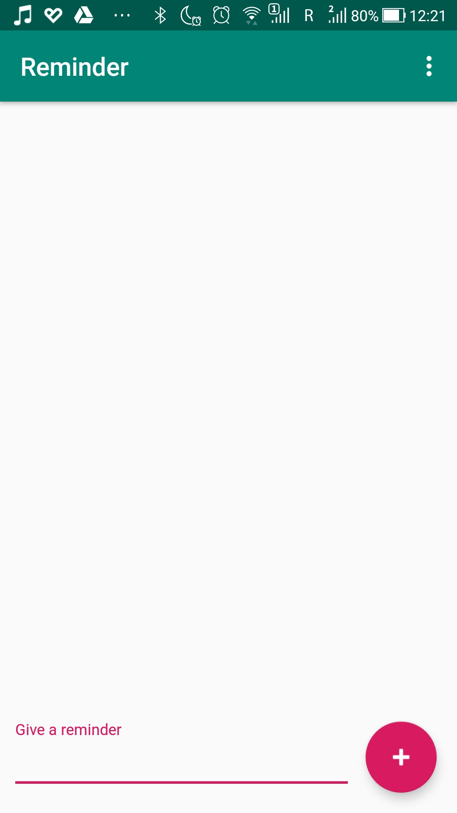
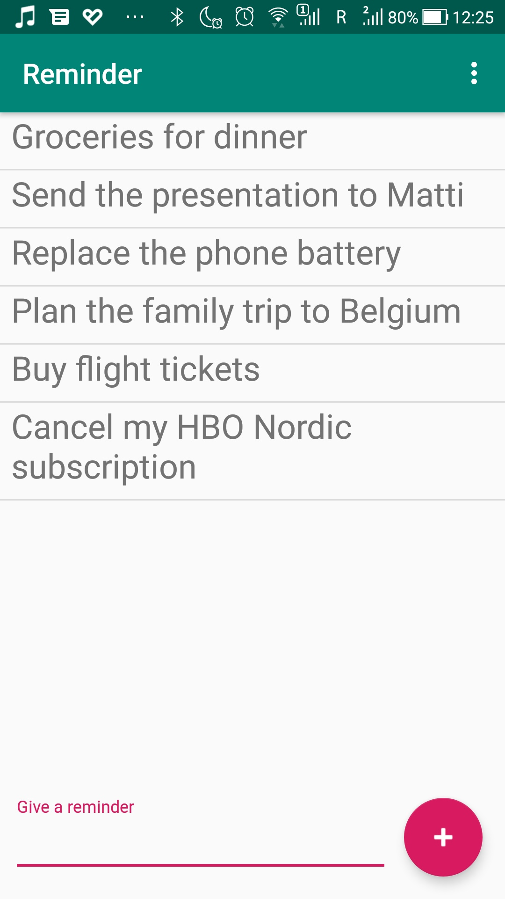
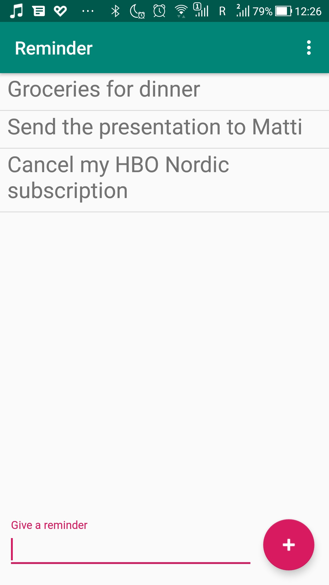

# Level 2 Example - Reminder app
This is the example that was shown on the second seminar. However, I have done it earlier because I aim at completing all 7 levels and I am completing the easier ones quicker in order to have more time to focus on the higher and more difficult levels.
## What's inside
This is the app that can be used to write down your reminders. 
## How it is implemented
We have used the Basic Activity template to create this project. Then there are these important components:
* <i>FloatingActionButton</i> in the bottom right corner. It is used to add a new item to the list.
* <i>TextInputLayout</i> in the bottom of the screen taking 75% of its width. It is used to enter the new reminder item text.
* <i>RecyclerView</i> which takes all the remaining space above the TextInputLayout. This element is a View that displays a scrolling list of elements that can be based on large data sets. It's like an advanced and flexible version of ListView. We can create a custom layout for the elements in the list.
* <i>TextView</i> in the item_reminder.xml - that's the textview for each particular element.
## Screenshots
    

